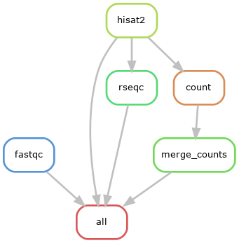

## Visualizing a larger workflow

This `Snakefile` includes a whole RNA-Seq workflow from fastq to counts. Please note that this
workflow is meant for illustration and should not be considered a best practices workflow.

With the profile and the config files, this wokflow can be run on the cluster with

```console
user@cn1234> snakemake --profile ./myprofile --jobs 12 --cluster-config=cluster.yml --local-cores 10
```

There are two ways to visualize the workflow. A rulegraph illustrates the relationship of the
rules to each other. Each rule is only shown once.

```console
user@cn1234> module load graphviz
user@cn1234> snakemake --rulegraph | dot -Tpng > rulegraph.png
```




